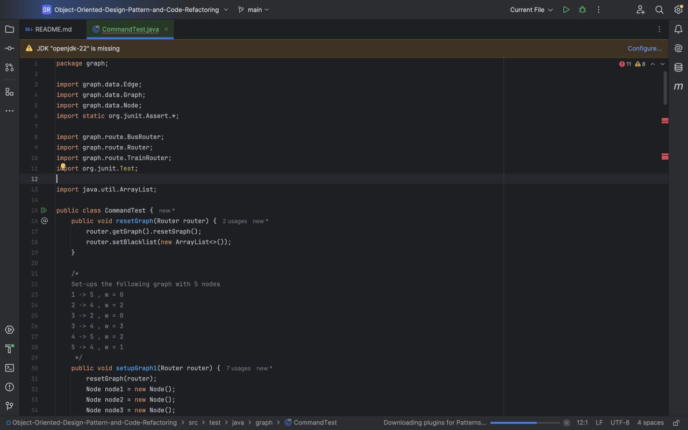
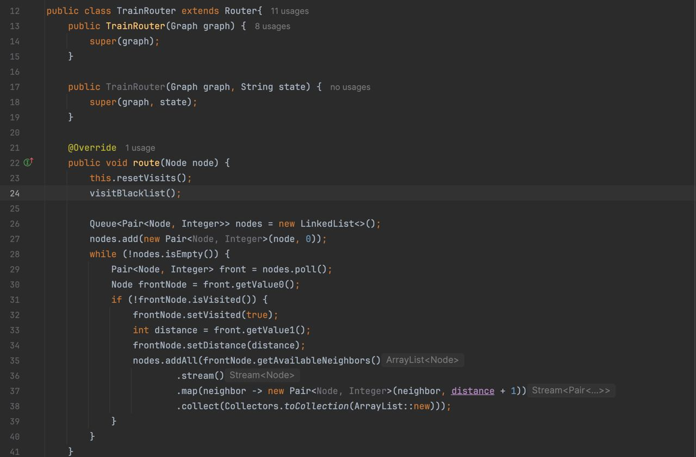
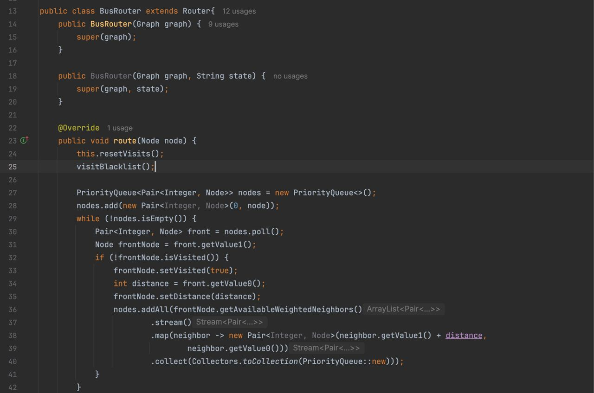
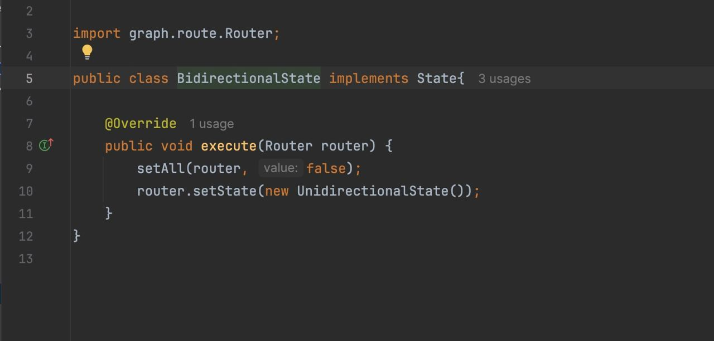
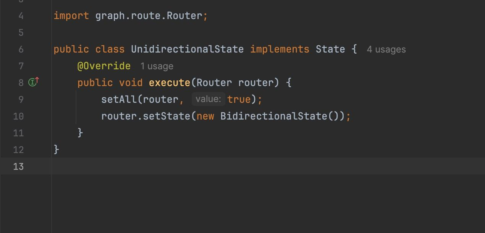
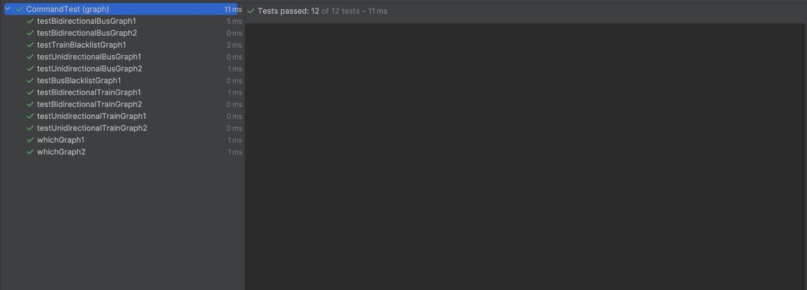
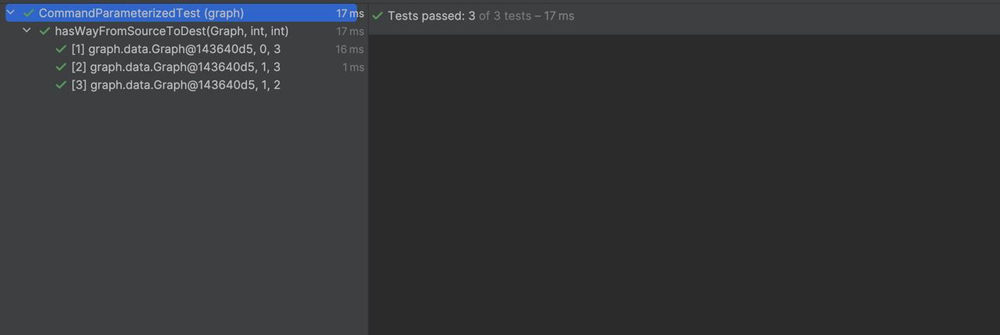

# Object oriented design patterns and Code refactoring experiment
Software engineering lab @ SUT

اعضای تیم:
- همراز عرفاتی ۹۹۱۰۹۷۹۹
- امیرحسین براتی ۹۹۱۰۱۳۰۸
- امیرحسین عابدی ۹۹۱۰۵۵۹۴

## فاز ۱

در ابتدا تست‌های برنامه را مینویسیم که با اپروچ TDD شروع به توسعه کد کنیم. به یک کلاس command نیاز داریم که تمامی فانکشنالیتی ‌های خواسته شده را پیاده سازی کند. این فانکشنالیتی‌ها عبارتند از distance, which, addHatedCity, toggleDirectional با استفاده از این توابع می‌توانیم هرچیزی که نیاز داریم را پیاده کنیم.



حال توضیح می‌دهیم که از State و Strategy در چه بخش‌هایی از برنامه استفاده کرده‌ایم. کلاس Router وظیفه پیدا کردن کمترین مسیر بین ۲ نود را دارد. از دیزاین پترن Strategy استفاده می‌کنیم که ۲ پیاده‌سازی مختلف از این کلاس داشته باشیم و همینطور خود کلاس Router هم یک کلاس abstract است که تابع route در آن هیچ پیاده‌سازی‌ای ندارد. بنابراین با استفاده از کلاس‌های BusRouter و TrainRouter خواسته مسئله را انجام می‌دهیم.




از دیزاین پترن State برای تاگل کردن بین Bidirectional و Unidirectional استفاده می‌کنیم. کلاس Router درون خودش یک فیلد state دارد که نشان‌ می‌دهد در حال حاضر دو طرفه است یا یک طرفه. هرکدام از این استیت‌ها یک پیاده‌سازی درون خود دارند که با کال کردن آن‌ها جهت درون یال‌ها فعال می‌شود و یا از بین می‌رود.




در انتها کافی است که در کلاس Main از کلاس Command استفاده کنیم و گراف را از یوزر بگیریم. همینطور می‌توانیم ببینیم که تست‌هایی که نوشته‌ایم به درستی کار می‌کنند.




## فاز ۲
در این فاز قصد داریم که در ابتدا ۲ مورد دیزاین پترن Facade را میخواهیم پیاده‌سازی کنیم. در ابتدا می‌بینیم که کلاس CodeGenerator توابع زیادی را expose کرده است و کلاس Parser که از این کلاس استفاده می‌کند از تعداد خیلی کمی از این توابع استفاده می‌کند. برای همین یک شی از نوع CodeGeneratorFacade می‌سازیم که فانکشنالیتی‌های لازم را برای کلاس Parser محیا می‌کند.


از این کلاس در Parser استفاده می‌کنیم. همینطور مشاهده می‌کنیم که در کلاس SymbolTable از کلاس Memory استفاده شده است اما از بین توابع زیادی که این کلاس ارائه می‌دهد فقط یکی از آن‌ها استفاده می‌شود. بنابراین یک MemoryFacade هم برای استفاده در کلاس SymbolTable می‌سازیم.


حال که دو مورد Facade را پیاده‌سازی کردیم یک کلاس با الگوی Strategy هم پیاده‌سازی می‌کنیم. در کلاس SymbolTable می‌بینیم که یک switch-statement داریم که فاکشنالیتی‌های مختلف کلاس action را پیاده‌سازی می‌کند. این switch-statement می‌تواند توسط دیزاین پترن Strategy بهبود یابد. کلاس Action را به صورت یک کلاس ابسترکت در می‌آوریم و همینطور enum act را حذف می‌کنیم. به جای اینکار ۳ پیاده‌سازی مختلف از Action خواهیم داشت که کار switch-statement زیر را می‌کنند.


۳ نوع Action با نام‌های AcceptAction, ReduceAction, ShiftAction داریم که کارهای خواسته شده را درون خودشان و در تابع act که در کلاس پدر وجود دارد پیاده می‌کنند. همینطور بعد از این کار تابع ToString هم پیاده‌سازی جدایی توسط هر ۳ کلاس دارد. در نهایت می‌توانیم با استفاده از این دیزاین پترن کل تصویر بالا را به یک خط زیر خلاصه کنیم.

```java
currentAction.act(this);
```

حال می‌خواهیم یک مورد separate query from modifier را اجرا کنیم. در کلاس Memory دو تابع getter با نام‌های getTemp و getDataAddress وجود دارند که علاوه بر وظیفه کوئری، آپدیت دیتا را هم انجام می‌دهند. برای بهبود کد دو تابع incrementTemp و incrementDataAddress اضافه می‌کنیم که جداگانه و هروقت که لازم بود این اعداد زیاد بشوند صدا زده می‌شوند.


در ادامه تکینک self encapsulated field را پیاده‌سازی میکنیم. در کلاس LexicalAnalyzer یک فیلد از نوع Matcher وجود دارد که همیشه بدون گتر و ستر از آن استفاده شده است. در ابتدا برای این فیلد ستر و گتر تعریف می‌کنیم و هرجا به مقدار آن نیاز داشتیم از گتر و هرکجا که نیاز داشتیم آن را ست کنیم از ستر استفاده می‌کنیم.


در مورد از ما خواسته شده است که ۲ تکنیک دلخواه را پیاده‌سازی کنیم. این ۲ تکنیک Hide method و Encapsulate collection هستند. در اولی توابع public که توسط یک کلاس ارائه می‌شوند اما توسط هیچ کلاسی غیر از خودشان استفاده نمی‌شود می‌توانند به private تغییر کنند. این توابع در کلاس CodeGenerator بسیار زیاد هستند و فقط در خود کلاس استفاده می‌شوند. بنابراین signature این توابع را به private تغییر می‌دهیم.


تکنیک دوم به این صورت کار می‌کند که اگر یک کلاس فیلدی از نوع کالکشن دارد نباید صرفا برای آن گتر و ستر داشته باشد، بلکه باید متود‌های Add, remove و getter داشته باشد به طوری که getter شی از نوع unmodifiable برگرداند. در پیاده‌سازی فعلی در کلاس Parser کالکشنی از نوع Stack<Integer> داریم که گتر دارد و از بیرون قابل تغییر است. برای جلوگیری از این کار برای این کالکشن توابع Pop, Head, Push را پیاده‌سازی می‌کنیم.


حال پلاگین formatter را به پروژه اضافه می‌کنیم و با اجرای کامند mvn formatter:format تمامی فایل‌های پروژه را فرمت می‌کنیم.


همانطور که مشخص است ۲۷ تا از ۳۵ تا فایل فرمت شده‌اند که در کامیت formatter:format فایل دیدن هستند. (فایل‌هایی که در پروژه graph قرار داشتند پوش نشدند.)


## سوالات
### سوال اول 
الگوهای ساختاری (Creational Patterns): این الگوها با مکانیزم‌های ایجاد شیء سر و کار دارند و هدفشان ایجاد اشیاء به شکلی مناسب برای شرایط مختلف است. به عنوان مثال، الگوی Singleton اطمینان می‌دهد که یک کلاس تنها یک نمونه داشته باشد.

الگوهای ساختاری (Structural Patterns): این الگوها به سازماندهی کلاس‌ها و اشیاء برای تشکیل ساختارهای بزرگ‌تر می‌پردازند. به عنوان مثال، الگوی Adapter اجازه می‌دهد که کلاس‌هایی با رابط‌های ناسازگار بتوانند با هم کار کنند.

الگوهای رفتاری (Behavioral Patterns): این الگوها بر چگونگی تعامل و تخصیص مسئولیت‌ها بین اشیاء تمرکز دارند. به عنوان مثال، الگوی Observer مکانیزمی را فراهم می‌کند که یک شیء بتواند تغییراتش را به دیگر اشیاء اطلاع دهد.

### سوال دوم

پترن‌های Strategy و State هر دو عضو دسته‌ی الگوهای رفتاری (Behavioral Patterns) هستند.الگوی Strategy به شما امکان می‌دهد که خانواده‌ای از الگوریتم‌ها را تعریف کرده و آن‌ها را به صورت قابل تعویض در برنامه استفاده کنید؛ و الگوی State به یک شیء اجازه می‌دهد که رفتار خود را زمانی که وضعیت داخلی‌اش تغییر می‌کند، تغییر دهد.


### سوال سوم


### سوال چهارم
<div dir="rtl">
Single Responsibility Principle (SRP):
الگوی Singleton معمولاً یک مسئولیت خاص را بر عهده دارد (ایجاد یک نمونه واحد از کلاس)، بنابراین این اصل را رعایت می‌کند. اما اگر Singleton وظایف دیگری به عهده بگیرد، ممکن است این اصل نقض شود.
</div>
<div dir="rtl">
Open/Closed Principle (OCP):
الگوی Singleton به دلیل اینکه محدود به یک نمونه است و تغییرات آن معمولاً نیاز به ویرایش کد دارد، اصول OCP را نقض می‌کند. توسعه و افزودن ویژگی‌های جدید بدون تغییر در کلاس اصلی دشوار است.
</div>
<div dir="rtl">
Liskov Substitution Principle (LSP):
Singleton با اصول LSP سازگار است زیرا جایگزینی کلاس‌های فرزند به ندرت در مورد Singleton رخ می‌دهد. با این حال، اگر Subclassing انجام شود، این اصل ممکن است به دلیل محدودیت‌های نمونه‌سازی نقض شود.
</div>
<div dir="rtl">
Interface Segregation Principle (ISP):
الگوی Singleton تأثیری بر ISP ندارد زیرا این اصل مرتبط با تعداد و نوع اینترفیس‌هایی است که یک کلاس پیاده‌سازی می‌کند. Singleton می‌تواند از اینترفیس‌ها استفاده کند یا نکند، اما این ارتباطی با تعداد نمونه‌های کلاس ندارد.
</div>
<div dir="rtl">
Dependency Inversion Principle (DIP):
الگوی Singleton اغلب اصول DIP را نقض می‌کند زیرا کلاس‌های دیگر به طور مستقیم به Singleton وابسته می‌شوند و این وابستگی را نمی‌توان به راحتی از طریق تزریق وابستگی (Dependency Injection) مدیریت کرد.
</div>


### سوال پنجم

کد تمیز (Clean Code):
کدی است که به راحتی قابل خواندن، فهمیدن و نگهداری است و از استانداردهای خوبی پیروی می‌کند.

بدهی فنی (Technical Debt):
مشکلات یا کوتاهی‌هایی در کد یا طراحی سیستم که برای تسریع توسعه ایجاد شده و نیاز به اصلاح در آینده دارد.

بوی بد (Code Smell):
نشانه‌هایی در کد که ممکن است نشان‌دهنده وجود مشکلاتی در طراحی یا پیاده‌سازی باشد و نیاز به بازآرایی دارند.


### سوال ششم

طبق دسته‌بندی وب‌سایت refactoring.guru، بوهای بد کد به پنج دسته تقسیم می‌شوند که هر یک به شرح زیر است:
<div dir="rtl">
Bloaters (کدهای بادکرده):
این دسته شامل کدهایی است که به مرور زمان رشد کرده‌اند و بسیار بزرگ یا پیچیده شده‌اند، مانند متدهای طولانی، کلاس‌های بزرگ، و داده‌های پیچیده.
</div>
<div dir="rtl">
Object-Orientation Abusers (سوء استفاده از شیء‌گرایی):
این دسته مربوط به مواردی است که اصول شیء‌گرایی به درستی رعایت نشده‌اند، مانند استفاده نادرست از ارث‌بری یا اجرای نادرست انتزاع (Abstraction).
</div>
<div dir="rtl">
Change Preventers (مانعین تغییر):
این دسته به مشکلاتی اشاره دارد که باعث می‌شود تغییر یا توسعه کد دشوار شود، مانند وابستگی‌های شدید بین ماژول‌ها و تغییرات جانبی زیاد در اثر تغییر یک بخش از کد.
</div>
<div dir="rtl">
Dispensables (موارد زائد):
این دسته شامل کدهایی است که وجودشان ضرورتی ندارد و می‌توانند حذف شوند بدون اینکه بر عملکرد برنامه تأثیر بگذارند، مانند کلاس‌های غیر ضروری، تکرار کد، و پارامترهای غیر استفاده.
</div>

<div dir="rtl">
Couplers (کوپلینگ‌های نادرست):
این دسته مربوط به مواردی است که در آن کلاس‌ها یا ماژول‌ها بیش از حد به یکدیگر وابسته هستند، مانند وابستگی‌های دوطرفه و کلاس‌هایی که بیش از حد به جزئیات دیگر کلاس‌ها دسترسی دارند.
</div>

### سوال هفتم

بوی بد Lazy Class در دسته‌بندی Dispensables (موارد زائد) قرار می‌گیرد. برای برطرف کردن این بوی بد، می‌توان از بازآرایی‌های زیر استفاده کرد:

کلاس‌های درخط (Inline Class): این بازآرایی شامل ادغام کلاس Lazy با کلاسی است که بیشترین تعامل را با آن دارد، زیرا کلاس Lazy وظایف مستقلی انجام نمی‌دهد و وجودش ضروری نیست.
  
ادعام سلسله مراتبی (Collapse Hierarchy): اگر کلاس Lazy بخشی از یک سلسله مراتب ارث‌بری است، می‌توان آن را با کلاس‌های والد یا فرزند ادغام کرد.
  

زمانی که برنامه در مرحله توسعه قرار دارد و انتظار می‌رود که در آینده وظایف یا ویژگی‌های بیشتری به کلاس Lazy اضافه شود، این بوی بد را می‌توان نادیده گرفت. در این حالت، وجود کلاس Lazy به عنوان یک ساختار آماده برای توسعه‌های آتی منطقی است.

### سوال هشتم
ده مورد از بوی بد در پروژه تبدیل‌کننده مدل به کد سی به صورت زیر است:


کلاس بزرگ (Large Class): برخی از کلاس‌ها وظایف متعددی انجام می‌دهند و می‌توانند به بخش‌های کوچکتر تقسیم شوند.
  
متد طولانی (Large Method): برخی متدها بیش از حد طولانی هستند و به وظایف متعدد پرداخته‌اند که نیاز به تجزیه به متدهای کوچکتر دارند.

کد تکراری (Duplicate Code): بخش‌های کد در قسمت‌های مختلف پروژه تکرار شده‌اند که می‌توانند با استفاده از توابع مشترک بهینه شوند.

بهم چسبیدگی داده‌ها (Data Clumps): گروه‌های متغیر که همواره با هم استفاده می‌شوند، باید به یک کلاس یا ساختار داده منتقل شوند.

کلی‌سازی بدون استفاده (Speculative Generality): برخی از کدها به صورت بیش از حد انتزاعی نوشته شده‌اند بدون اینکه نیاز واقعی به این انتزاع باشد.

وابستگی به نوع‌های ابتدایی (Primitive Obsession): استفاده زیاد از نوع‌های داده اولیه به جای اشیاء می‌تواند مشکلات نگهداری کد را افزایش دهد.

حسادت ویژگی (Feature Envy): برخی از متدها بیش از حد به داده‌ها و متدهای کلاس‌های دیگر دسترسی دارند، که نشان‌دهنده نیاز به بازآرایی است.

صمیمیت نامناسب (Inappropriate Intimacy): کلاس‌ها بیش از حد به جزئیات داخلی یکدیگر وابسته‌اند.

کلاس تنبل (Lazy Class): برخی از کلاس‌ها کار خاصی انجام نمی‌دهند و می‌توانند حذف یا با کلاس‌های دیگر ادغام شوند.

فیلد موقتی (Temporary Field): برخی از متغیرهای کلاس فقط در شرایط خاصی استفاده می‌شوند که نشان‌دهنده نیاز به انتقال این منطق به مکان مناسب‌تر است.

### سوال نهم

پلاگین formatter در پروژه‌های جاوا وظیفه‌ی فرمت کردن کدها بر اساس سبک‌ها و استانداردهای مشخصی را دارد. این پلاگین به یکپارچه‌سازی و خوانایی کد کمک می‌کند، به طوری که تمامی کدها از نظر قالب‌بندی همگون و منظم باشند. رابطه آن با بازآرایی کد در این است که پس از انجام تغییرات و بهبودهای ساختاری (Refactoring)، استفاده از این پلاگین می‌تواند از نظر فرمت اطمینان حاصل کند که کدها همچنان خوانا و به صورت استاندارد باقی می‌مانند.


## جبرانی کوییز همراز عرفاتی
برای این بخش، همانطور که خواسته شده بود یک کلاس تست پارامتری اضافه شد. جایگاه آن هم در 
src/test/java/graph/CommandParameterizedTest
است که در صورت اجرا کردن تست‌ها، تست چند بار با ورودی‌های متفاوت اجرا می‌شود و باید به ازای هریک از آنها پاس شود. استفاده از این روش می‌تواند در زمان برنامه‌نویس صرفه‌جویی کند چرا که نیازی به دوباره نویسی یک تست برای یک سناریو با ورودی‌های مختلف نیست. تصویر زیر هم در رابطه با اجرای تست پارامتری پروژه است:



